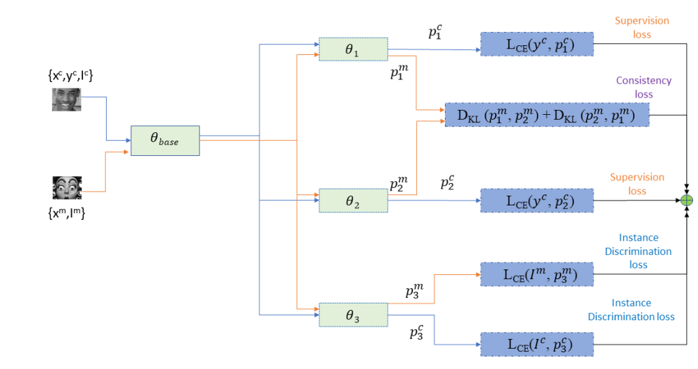
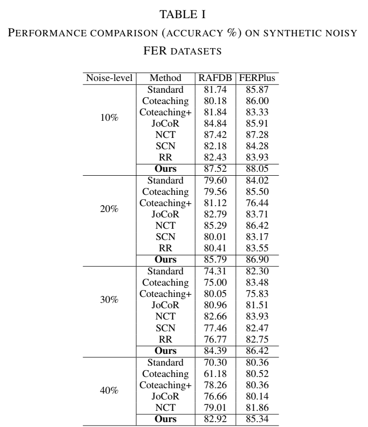
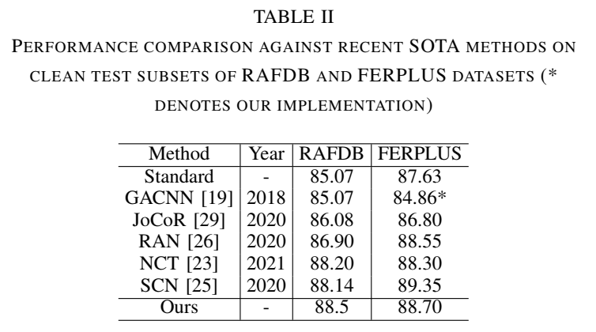

<strong>Title: Instance Discrimination based Robust Training for Facial Expression Recognition under Noisy Labels

<strong> Our proposed FER framework:<strong>

  
  <strong> Results on Synthetic Noisy Datasets <strong>

    
     <strong> Results on Clean Benchmark Datasets <strong>

  
Authors: G N Vikas, Darshan Gera and Dr. S. Balasubramanian, SSSIHL.

Any queries please mail to: gnvikas@gmail.com OR darshangera@sssihl.edu.in.  

Acknowledgments:
We dedicate this work to Bhagawan Sri Sathya Sai Baba, Divine Founder Chancellor of Sri Sathya Sai Institute of Higher Learning, PrasanthiNilyam, A.P., India.

  
