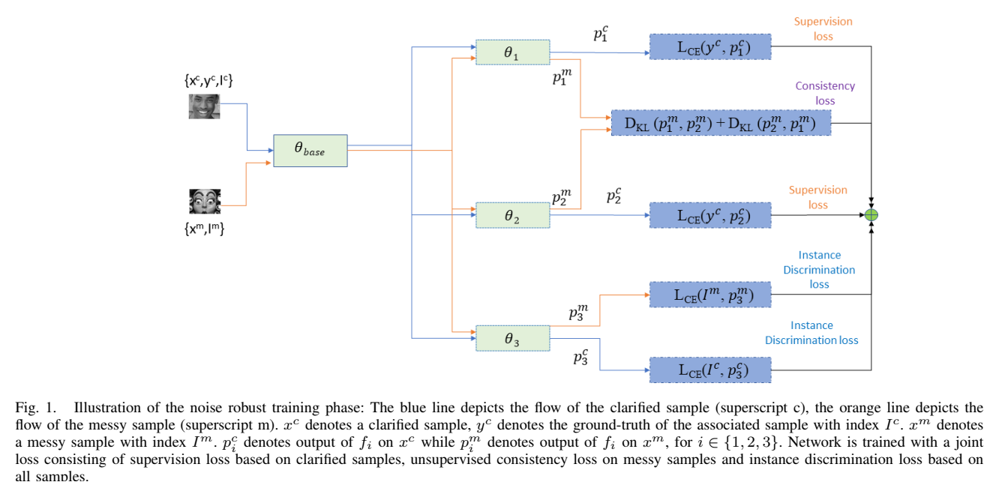

<strong>Title: Instance Discrimination based Robust Training for Facial Expression Recognition under Noisy Labels

<strong> Our proposed FER framework:<strong>

Acknowledgments:
We dedicate this work to Bhagawan Sri Sathya Sai Baba, Divine Founder Chancellor of Sri Sathya Sai Institute of Higher Learning, PrasanthiNilyam, A.P., India.

  
